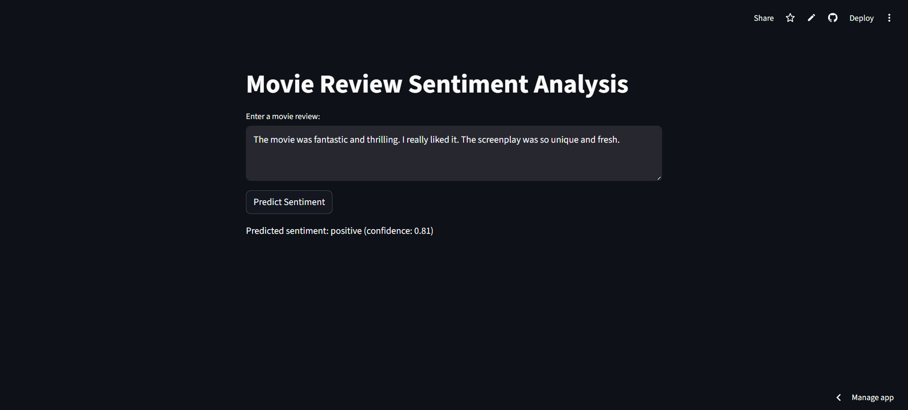

# 🎬 Movie Review Sentiment Analysis (RNN + Streamlit)

## 🌐 Live App
https://rnn-movie-review-sentiment.streamlit.app/

---

## 🧠 Problem Statement

Understanding sentiment from text is a fundamental problem in Natural Language Processing.

In the context of movie reviews, identifying whether a review is positive or negative helps in analyzing audience perception and improving content strategies.

Instead of manually reading thousands of reviews, we can build a system that automatically classifies sentiment based on learned patterns in text.

This project builds an end-to-end system to:

- Classify movie reviews as positive or negative  
- Understand how sequence-based models process text  
- Provide real-time sentiment predictions through an interactive application  

---

## 🚀 What I Built

This is a complete deep learning application, not just a model.

✔ Text preprocessing pipeline using IMDB word index  
✔ Sequence encoding and padding  
✔ Recurrent Neural Network (SimpleRNN) for sentiment classification  
✔ Model training and evaluation  
✔ Reusable prediction pipeline  
✔ Interactive Streamlit web application  
✔ Live deployment for real-time predictions  

This system demonstrates how deep learning models can be applied to real-world NLP problems.

---

## 📸 App Preview



---

## 📊 Key Observations

- SimpleRNN can capture basic sentiment patterns in text  
- Model performance depends heavily on vocabulary and preprocessing  
- Certain words strongly influence predictions  
- Context understanding is limited compared to advanced models like LSTM  

---

## 🛠 Tech Stack

- Python 3.11  
- TensorFlow / Keras (RNN)  
- NumPy  
- Streamlit (deployment)  

---

## 🧩 How It Works

1. User enters a movie review  
2. Text is converted into numerical sequence using IMDB word index  
3. Sequence is padded to fixed length  
4. RNN model processes the sequence  
5. App returns:
   - Sentiment (Positive / Negative)  
   - Confidence score  

---

## 📈 Model Behavior

The model performs well on general sentiment patterns but may struggle with:

- Long and complex sentences  
- Subtle or mixed sentiment  
- Words outside the trained vocabulary  

This highlights the limitations of SimpleRNN in capturing long-term dependencies.

---

## 🎯 Skills Demonstrated

- Deep Learning (RNN, sequence modeling)  
- NLP preprocessing techniques  
- Model deployment using Streamlit  
- End-to-end ML application development  
- Handling real-world inference issues (vocabulary constraints)  

---

## ▶️ Run Locally

```bash
git clone https://github.com/your-username/movie-review-sentiment-rnn.git

cd movie-review-sentiment-rnn

py -3.11 -m venv venv
.\venv\Scripts\Activate.ps1

pip install -r requirements.txt

streamlit run app.py

```
---

🔮 Future Improvements
- Replace SimpleRNN with LSTM / GRU
- Use custom tokenizer instead of IMDB mapping
- Improve preprocessing pipeline
- Enhance model accuracy with tuning
- Improve UI/UX of the application

